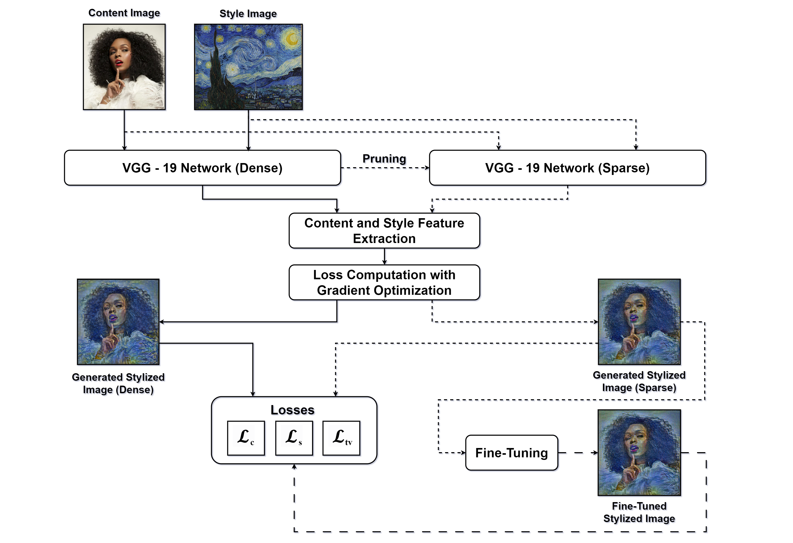
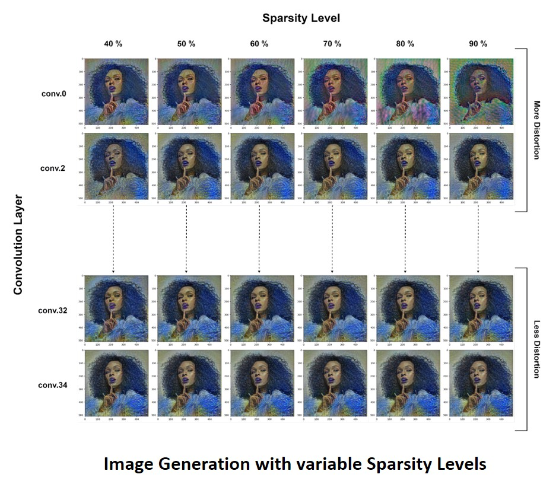
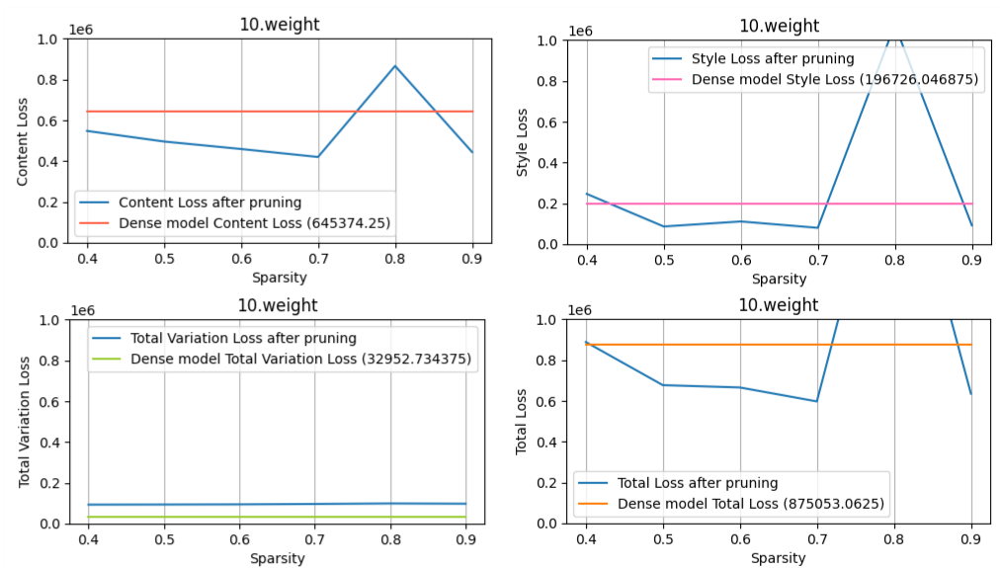

# Deep Neural Compression For Neural Style Transfer

This Project focuses on optimizing Neural Style Transfer (NST) model using deep neural compression teachnique (Pruning). By reducing the model size and maintaining high-quality stylized images, we aim to enhance the computational efficiency and resource constraints of a typical dense neural network.

This Project implements and advances [Image Style Transfer Using Convolutional Neural Networks](https://www.cv-foundation.org/openaccess/content_cvpr_2016/papers/Gatys_Image_Style_Transfer_CVPR_2016_paper.pdf) by Leon Gatys, Alexander Ecker, and Matthias Bethge, by introducing Total Variation Loss For maintaining spatial smoothness and Fine-Grained Pruning for removing less important weights and edges based on magnitude (L1 norm).

## Proposed Architecture and Workflow

Our Proposed Arctitecture utilizes a pre-trained CNN (VGG-19) with it's original caffe weights as the model for processing Neural Style Transfer, which involved extracting low level image features and optimizing them on Content, Style and TV Losses. Then the model is pruned using fine-grained and loss is computed for it again and optimized for generating stylized image. At the end, the pruned model is fine-tuned for recovering any loss in perception quality.

## Sensitivity Analysis
For finding the best sparsity ratio for each convolution layer in the VGG-19 network, we employed a sensitivity scan for 6 sparsity levels (40% to 90% with steo size of 10%) for 500 iterations each which resulted in 48,000 iterations total and resulted in some intersting insights.
It was observed that the early layers were more sensitive to pruning as compared to denser layers and thus, the sparsity level was set accordingly. The following image shows a visual depiction of the analysis:

Sample Sensitivity Curves For Conv.10 Layer

## Sample Input/Outputs

