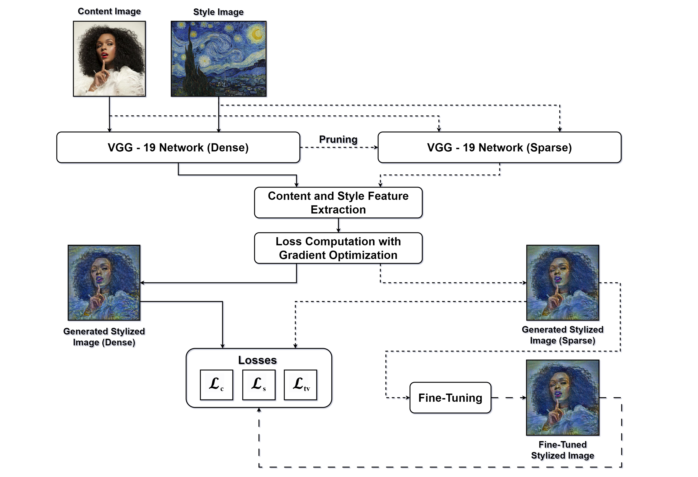
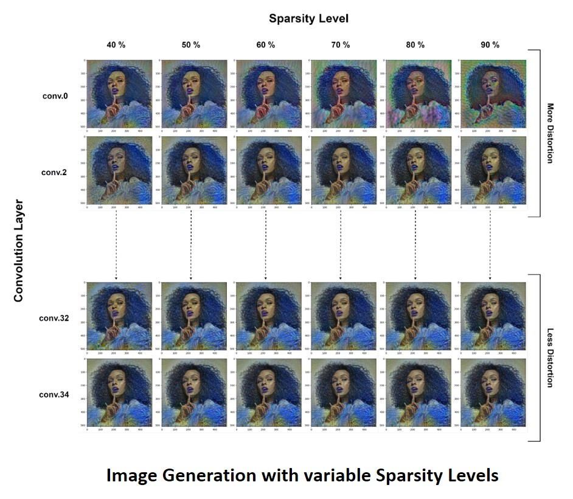
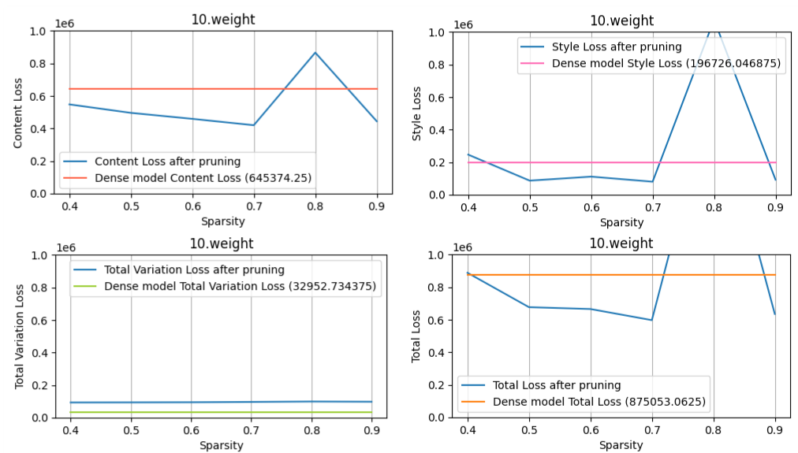

# 🖼️ Deep Neural Compression For Neural Style Transfer

## 📌 Overview
This project focuses on optimizing **Neural Style Transfer (NST)** using **deep neural compression techniques** (Pruning). By reducing the model size while maintaining high-quality stylized images, we aim to enhance the computational efficiency and overcome resource constraints of typical dense neural networks.

This project builds upon the paper [Image Style Transfer Using Convolutional Neural Networks](https://www.cv-foundation.org/openaccess/content_cvpr_2016/papers/Gatys_Image_Style_Transfer_CVPR_2016_paper.pdf) by **Leon Gatys, Alexander Ecker, and Matthias Bethge**, extending the original work by incorporating:
- **Total Variation (TV) Loss** for spatial smoothness.
- **Fine-Grained Pruning** using **L1 norm** to remove unimportant weights and edges.

---

## 🎯 Features
✅ **Optimized NST Model**: Implements fine-grained pruning to improve efficiency.  
✅ **Pre-Trained VGG-19**: Uses original **Caffe weights** for feature extraction.  
✅ **Sensitivity Analysis**: Determines the best sparsity ratio for each convolution layer.  
✅ **Total Variation Loss**: Enhances spatial smoothness in output images.  
✅ **Interactive Jupyter Notebook**: Experiment with hyperparameters easily.  

---

## 🏗️ Project Structure
```
📦 Deep Neural Compression for NST
├── 📂 images
│   ├── (Images/Diagrams For README)
│   ├── content-1.png
│   └── style-1.jpg
├── .gitignore
├── Deep_Neural_Compression_For_NST.ipynb
├── README.md
├── models-download.sh
└── requirements.txt
```

---

## 🛠️ Hyperparameters
- **`MAX_IMAGE_SIZE`**: Maximum allowed image resolution for processing (default: 512 pixels).
- **`OPTIMIZER`**: Optimization algorithm used for updating the model weights (default: Adam).
- **`ADAM_LR`**: Learning rate for the Adam optimizer (default: 10).
- **`CONTENT_WEIGHT`**: Weight assigned to the content loss during optimization (default: 5e0).
- **`STYLE_WEIGHT`**: Weight assigned to the style loss during optimization (default: 1e2).
- **`TV_WEIGHT`**: Weight for the total variation loss to enforce smoothness (default: 1e-3).
- **`NUM_ITER`**: Number of iterations for the NST optimization process (default: 500).
- **`SHOW_ITER`**: Frequency of displaying output images during training (default: every 100 iterations).
- **`INIT_IMAGE`**: Initialization method for the stylized image (default: 'random').
- **`CONTENT_PATH`**: File path to the content image.
- **`STYLE_PATH`**: File path to the style image.
- **`VGG19_PATH`**: Path to the pre-trained VGG-19 model weights.
- **`device`**: Determines whether to use GPU (`'cuda'`) or CPU for computation.

---

## 🏗️ Proposed Architecture & Workflow
Our proposed architecture utilizes a **pre-trained VGG-19** model with original **Caffe weights** for processing NST. The workflow includes:
1. Extracting low-level image features.
2. Optimizing the model based on **Content, Style, and Total Variation Losses**.
3. **Fine-Grained Pruning** of the model.
4. Recomputing loss and optimizing for stylized image generation.
5. **Fine-Tuning the pruned model** to recover perception quality.

**Architecture Diagram:**



---

## 🔬 Sensitivity Analysis
To find the optimal **sparsity ratio** for each convolution layer in **VGG-19**, we conducted a sensitivity scan:
- **Sparsity Levels:** 40% to 90% (step size: 10%).
- **Iterations:** 500 per level.
- **Total Iterations:** 48,000 -> (500 iters * 6 sparse levels * 16 conv layers). 

**Findings:** Early layers were more sensitive to pruning than deeper layers. The final sparsity levels were adjusted accordingly.

**Sensitivity Analysis Visualization:**



**Sample Sensitivity Curves for Conv.10 Layer:**



---

## 📊 Model Metric Analysis

| 🏷️ Model           | 🔢 No. of Parameters | 📦 Model Size | 📉 Compression Rate |
|------------------|------------------|------------|----------------|
| **VGG-19 (original)** | 20.02M           | 76.39 MiB  | ❌ (Baseline)  |
| **VGG-19 (pruned)**   | 3.02M            | 11.52 MiB  | ⚡ 6.64×        |

### 🔍 Summary:
- The **pruned model** achieves a **6.64× compression (~85%)** while reducing the parameter count from **20.02M ➝ 3.02M**. 🚀  
- The model size decreases **from 76.39 MiB to 11.52 MiB**, making it significantly more efficient. 📉  

💡 *This compression helps reduce memory usage while maintaining essential features!*  

---

## 🖼️ Sample Input & Outputs


---

## ⚙️ Installation & Setup
### 1️⃣ Prerequisites  
- **Python 3.12+**  
- **Jupyter Notebook**  
- **PyTorch & torchvision**  
- **Matplotlib, NumPy, Tqdm, OpenCV**  

### 2️⃣ Clone the Repository  
```sh
git clone https://github.com/Ilesh-Dhall/Deep-Neural-Compression-For-Neural-Style-Transfer.git
cd Deep-Neural-Compression-For-Neural-Style-Transfer
```

### 3️⃣ Install Dependencies  
```sh
pip install -r requirements.txt
```

### 4️⃣ Download Pre-Trained Model Weights  
```sh
bash models-download.sh
```

### 5️⃣ Run the Project  
```sh
jupyter notebook
```
- Open `Deep_Neural_Compression_For_Neural_Style_Transfer_Project.ipynb` and execute the cells.  
- Set **content & style images** and adjust hyperparameters.  
- Run the model and generate **stylized images**!  

---

## 🚀 Applications  
This optimized NST model can be used in:

1️⃣ **Art & Creativity** – Generate stylized artwork from images.  
2️⃣ **Low-Power Edge Devices** – Efficient NST for mobile & embedded systems.  
3️⃣ **Real-Time Video Processing** – Faster style transfer in videos.  
4️⃣ **AI-Assisted Design** – Apply artistic styles to digital media.  

---

## 📚 References
1️⃣ Leon A. Gatys, Alexander S. Ecker, Matthias Bethge, “Image Style Transfer Using Convolutional Neural Networks”, in Proceedings of the IEEE Conference on Computer Vision and Pattern Recognition, 2016, pp. 2414-2423.  
2️⃣ Song Han, Jeff Pool, John Tran, William J. Dally, “Learning Both Weights and Connections for Efficient Neural Networks”, in Advances in Neural Information Processing Systems, vol. 28, 2015, pp. 1135–1143.  
3️⃣ Song Han, Huizi Mao, William J. Dally, “Deep Compression: Compressing Deep Neural Networks with Pruning, Trained Quantization and Huffman Coding”, in Proceedings of the International Conference on Learning Representations (ICLR), 2016, pp. 1–13.  
4️⃣ Total Variation Denoising [Online]. Accessed on 3rd January 2024: https://en.wikipedia.org/wiki/Total_variation_denoising  

🎨 **Enjoy experimenting with style transfer!** 🚀
